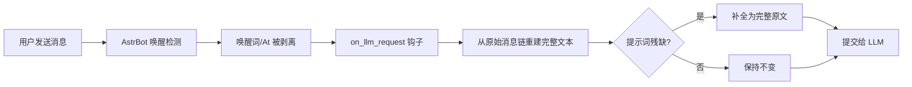

# astrbot_plugin_full_prompt

修复 AstrBot 中**唤醒词 / @机器人 被剥离**导致提交给 LLM 的提示词残缺的问题。

## 问题现象

例如你发送 `宁宁，你在哪`，唤醒词 `宁宁` 会被 AstrBot 的唤醒检测逻辑剥离，
最终提交给大模型的提示词变成了 `，你在哪`，对话体验非常奇怪。

### 修复前 vs 修复后

| 你发送的内容 | 修复前提交给 LLM | 修复后提交给 LLM |
| --- | --- | --- |
| 宁宁，你在哪 | ，你在哪 | 宁宁，你在哪 |
| @机器人 帮我写首诗 | 帮我写首诗 | 宁宁 帮我写首诗 |

## 解决方案

本插件通过 AstrBot 的 `on_llm_request` 钩子，在请求发出前从**原始消息链**重建完整文本：

- 把 `@机器人` 替换为机器人昵称（默认 `宁宁`，可配置，支持按群不同昵称）
- 比对 `req.prompt` 与重建文本，若提示词确实被剥离了开头内容，则补全为完整原文
- 多轮对话/工具调用场景做了保护，不会误伤非用户原话的请求
- 支持按群排除、私聊开关

### 工作原理

## 安装

1. 将本目录放入 AstrBot 的 `data/plugins/` 下
2. 在 WebUI 插件管理页面刷新并启用插件

## 配置

| 配置项 | 类型 | 默认值 | 说明 |
| --- | --- | --- | --- |
| `bot_name` | string | `宁宁` | 默认昵称/唤醒词（兜底）：群和 Bot 都没单独配置时使用 |
| `bot_name_map` | list | 空 | 按群自定义昵称，面板逐条填：`群号,昵称` |
| `bot_name_by_self_id` | list | 空 | 按Bot账号自定义昵称（唤醒词），面板逐条填：`QQ号,昵称` |
| `keep_at_marker` | bool | `false` | 开启后不替换为名字，保留原始 `[At:qq]` 标记 |
| `exclude_groups` | list | 空 | 不补全提示词的群号列表 |
| `enable_private` | bool | `true` | 私聊是否补全提示词 |

### 按群昵称示例

点开该配置项，逐条点「添加」填写：`748791823,老大`；再填一条 `1092801060,宁宁`（半角逗号）。

在群 748791823 中 @机器人 会替换为"老大"，在群 1092801060 中替换为"宁宁"，其他群用 `bot_name`。

### 按Bot账号昵称示例（多账号挂载）

点开该配置项，逐条点「添加」填写：`10001,宁宁`；再填一条 `10002,小助手`（半角逗号）。

同一个 AstrBot 挂多个机器人账号时，`10001` 这个 bot 收到的消息把 @机器人 替换为"宁宁"，
`10002` 收到的替换为"小助手"。私聊场景没有群号，也能靠这个配置区分。

> 优先级：按群 `bot_name_map` > 按Bot `bot_name_by_self_id` > 全局 `bot_name` > 默认 `宁宁`。

## 兼容性

- 支持平台：aiocqhttp
- AstrBot 版本：`>=v4.12.0`

## License

MIT
